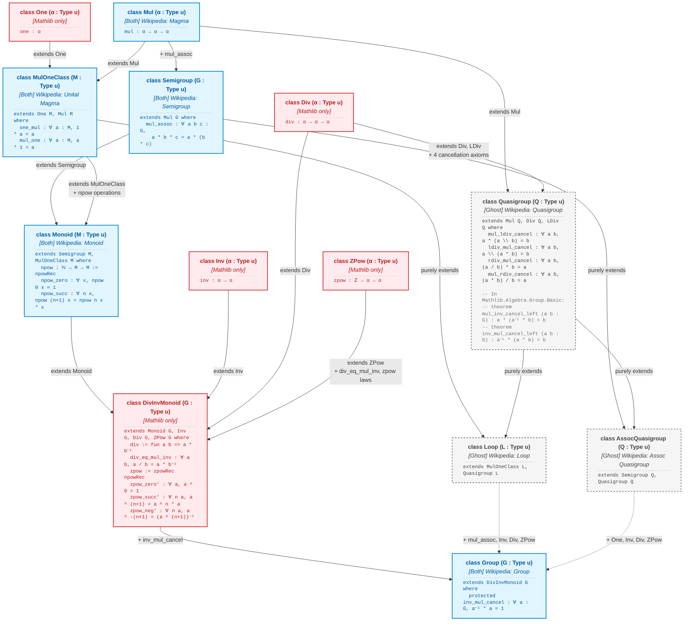

Here is the updated hierarchy diagram.

### Color Legend
* <span style="color:#0288d1; font-weight:bold;">■ Blue</span>: Present in **both** Wikipedia and Mathlib (`Mul`, `Semigroup`, `MulOneClass`, `Monoid`, `Group`).
* <span style="color:#757575; font-weight:bold;">■ Grey</span>: Present **only in Wikipedia** (ghost classes: `Quasigroup`, `Loop`, `AssocQuasigroup`).
* <span style="color:#d32f2f; font-weight:bold;">■ Red</span>: Present **only in Mathlib** (notation mix-ins and structural classes: `One`, `Div`, `Inv`, `ZPow`, `DivInvMonoid`).

---

### Mermaid Diagram



```d2
direction: down

# --- STYLE DEFINITIONS ---
classes: {
  both: {
    style: {
      fill: "#e1f5fe"
      stroke: "#0288d1"
      stroke-width: 2
    }
  }
  wikiOnly: {
    style: {
      fill: "#f5f5f5"
      stroke: "#757575"
      stroke-width: 2
      stroke-dash: 4
    }
  }
  mathlibOnly: {
    style: {
      fill: "#ffebee"
      stroke: "#d32f2f"
      stroke-width: 2
    }
  }
}

# ==========================================
# LEVEL 0: BASE NOTATION CLASSES
# ==========================================
One: {
  class: mathlibOnly
  label: |md
    ### class One (α : Type u)
    *[Mathlib only]*
    ***
    ```lean
    one : α
    ```
  |
}

Mul: {
  class: both
  label: |md
    ### class Mul (α : Type u)
    *[Both] Wikipedia: Magma*
    ***
    ```lean
    mul : α → α → α
    ```
  |
}

Div: {
  class: mathlibOnly
  label: |md
    ### class Div (α : Type u)
    *[Mathlib only]*
    ***
    ```lean
    div : α → α → α
    ```
  |
}

Inv: {
  class: mathlibOnly
  label: |md
    ### class Inv (α : Type u)
    *[Mathlib only]*
    ***
    ```lean
    inv : α → α
    ```
  |
}

ZPow: {
  class: mathlibOnly
  label: |md
    ### class ZPow (α : Type u)
    *[Mathlib only]*
    ***
    ```lean
    zpow : ℤ → α → α
    ```
  |
}

# ==========================================
# LEVEL 1: 1 AXIOM
# ==========================================
Semigroup: {
  class: both
  label: |md
    ### class Semigroup (G : Type u)
    *[Both] Wikipedia: Semigroup*
    ***
    ```lean
    extends Mul G where
      mul_assoc : ∀ a b c : G,
        a * b * c = a * (b * c)
    ```
  |
}

UnitalMagma: {
  class: both
  label: |md
    ### class MulOneClass (M : Type u)
    *[Both] Wikipedia: Unital Magma*
    ***
    ```lean
    extends One M, Mul M where
      one_mul : ∀ a : M, 1 * a = a
      mul_one : ∀ a : M, a * 1 = a
    ```
  |
}

Quasigroup: {
  class: wikiOnly
  label: |md
    ### class Quasigroup (Q : Type u)
    *[Ghost] Wikipedia: Quasigroup*
    ***
    ```lean
    extends Mul Q, Div Q, LDiv Q where
      mul_ldiv_cancel : ∀ a b, a * (a \ b) = b
      ldiv_mul_cancel : ∀ a b, a \ (a * b) = b
      rdiv_mul_cancel : ∀ a b, (a / b) * b = a
      mul_rdiv_cancel : ∀ a b, (a * b) / b = a

    -- In Mathlib.Algebra.Group.Basic:
    -- theorem mul_inv_cancel_left (a b : G) : a * (a⁻¹ * b) = b
    -- theorem inv_mul_cancel_left (a b : G) : a⁻¹ * (a * b) = b
    ```
  |
}

# ==========================================
# LEVEL 2: 2 AXIOMS
# ==========================================
Monoid: {
  class: both
  label: |md
    ### class Monoid (M : Type u)
    *[Both] Wikipedia: Monoid*
    ***
    ```lean
    extends Semigroup M, MulOneClass M where
      npow : ℕ → M → M := npowRec
      npow_zero : ∀ x, npow 0 x = 1
      npow_succ : ∀ n x, npow (n+1) x = npow n x * x
    ```
  |
}

Loop: {
  class: wikiOnly
  label: |md
    ### class Loop (L : Type u)
    *[Ghost] Wikipedia: Loop*
    ***
    ```lean
    extends MulOneClass L, Quasigroup L
    ```
  |
}

AssocQuasi: {
  class: wikiOnly
  label: |md
    ### class AssocQuasigroup (Q : Type u)
    *[Ghost] Wikipedia: Assoc Quasigroup*
    ***
    ```lean
    extends Semigroup Q, Quasigroup Q
    ```
  |
}

# ==========================================
# LEVEL 2.5: MATHLIB INTERMEDIATE
# ==========================================
DivInvMonoid: {
  class: mathlibOnly
  label: |md
    ### class DivInvMonoid (G : Type u)
    *[Mathlib only]*
    ***
    ```lean
    extends Monoid G, Inv G, Div G, ZPow G where
      div := fun a b => a * b⁻¹
      div_eq_mul_inv : ∀ a b, a / b = a * b⁻¹
      zpow := zpowRec npowRec
      zpow_zero' : ∀ a, a ^ 0 = 1
      zpow_succ' : ∀ n a, a ^ (n+1) = a ^ n * a
      zpow_neg' : ∀ n a, a ^ -(n+1) = (a ^ (n+1))⁻¹
    ```
  |
}

# ==========================================
# LEVEL 3: ALL AXIOMS (COLLAPSE TARGET)
# ==========================================
Group: {
  class: both
  label: |md
    ### class Group (G : Type u)
    *[Both] Wikipedia: Group*
    ***
    ```lean
    extends DivInvMonoid G where
      protected inv_mul_cancel : ∀ a : G, a⁻¹ * a = 1
    ```
  |
}

# ==========================================
# EDGES / INHERITANCE
# ==========================================
# To Semigroup
Mul -> Semigroup: "+ mul_assoc"

# To MulOneClass
One -> UnitalMagma: "extends One"
Mul -> UnitalMagma: "extends Mul"

# To Quasigroup
Mul -> Quasigroup: "extends Mul"
Div -> Quasigroup: |md
  extends Div, LDiv
  + 4 cancellation axioms
|

# To Monoid
Semigroup -> Monoid: "extends Semigroup"
UnitalMagma -> Monoid: |md
  extends MulOneClass
  + npow operations
|

# To Loop & AssocQuasigroup
UnitalMagma -> Loop: "purely extends"
Quasigroup -> Loop: "purely extends"
Semigroup -> AssocQuasi: "purely extends"
Quasigroup -> AssocQuasi: "purely extends"

# To DivInvMonoid
Monoid -> DivInvMonoid: "extends Monoid"
Inv -> DivInvMonoid: "extends Inv"
Div -> DivInvMonoid: "extends Div"
ZPow -> DivInvMonoid: |md
  extends ZPow
  + div_eq_mul_inv, zpow laws
|

# To Group (Collapse)
DivInvMonoid -> Group: "+ inv_mul_cancel"

Loop -> Group: "+ mul_assoc, Inv, Div, ZPow" {
  style.stroke-dash: 4
}

AssocQuasi -> Group: "+ One, Inv, Div, ZPow" {
  style.stroke-dash: 4
}
```

---

### Full Lean 4 Implementations of the Added Classes

#### 1. Mathlib-only Classes (<span style="color:#d32f2f;">Red</span>)
```lean
-- Standalone notation classes
class One (α : Type u) where
  one : α

class Div (α : Type u) where
  div : α → α → α

class Inv (α : Type u) where
  inv : α → α

class ZPow (α : Type u) where
  zpow : ℤ → α → α

-- Intermediate structure used to resolve diamond inheritance for division and integer powers
class DivInvMonoid (G : Type u) extends Monoid G, Inv G, Div G, ZPow G where
  protected div := fun a b => a * b⁻¹
  protected div_eq_mul_inv : ∀ a b : G, a / b = a * b⁻¹ := by intros; rfl
  zpow := zpowRec npowRec
  protected zpow_zero' (a : G) : a ^ (0 : ℤ) = 1 := by intros; rfl
  protected zpow_succ' (n : ℕ) (a : G) : a ^ (n.succ : ℤ) = a ^ (n : ℤ) * a := by intros; rfl
  protected zpow_neg' (n : ℕ) (a : G) : a ^ Int.negSucc n = (a ^ (n.succ : ℤ))⁻¹ := by intros; rfl
```

#### 2. Both Wikipedia & Mathlib (<span style="color:#0288d1;">Blue</span>)
```lean
class Mul (α : Type u) where
  mul : α → α → α

class Semigroup (G : Type u) extends Mul G where
  mul_assoc : ∀ a b c : G, a * b * c = a * (b * c)

class MulOneClass (M : Type u) extends One M, Mul M where
  one_mul : ∀ a : M, 1 * a = a
  mul_one : ∀ a : M, a * 1 = a

class Monoid (M : Type u) extends Semigroup M, MulOneClass M where
  npow : ℕ → M → M := npowRec
  npow_zero : ∀ x : M, npow 0 x = 1 := by intros; rfl
  npow_succ : ∀ (n : ℕ) (x : M), npow (n + 1) x = npow n x * x := by intros; rfl

class Group (G : Type u) extends DivInvMonoid G where
  protected inv_mul_cancel : ∀ a : G, a⁻¹ * a = 1
```

#### 3. Wikipedia-only Ghost Classes (<span style="color:#757575;">Grey</span>)
```lean
-- Left division notation class (mirror of Div)
class LDiv (α : Type u) where
  ldiv : α → α → α

infixl:70 " \\ " => LDiv.ldiv

-- Quasigroup extends operations Mul, Div, and LDiv with Latin-square laws
class Quasigroup (Q : Type u) extends Mul Q, Div Q, LDiv Q where
  mul_ldiv_cancel : ∀ a b : Q, a * (a \ b) = b
  ldiv_mul_cancel : ∀ a b : Q, a \ (a * b) = b
  rdiv_mul_cancel : ∀ a b : Q, (a / b) * b = a
  mul_rdiv_cancel : ∀ a b : Q, (a * b) / b = a

-- Pure multi-inheritance: zero new fields
class Loop (L : Type u) extends MulOneClass L, Quasigroup L

-- Pure multi-inheritance: zero new fields
class AssocQuasigroup (Q : Type u) extends Semigroup Q, Quasigroup Q
```
